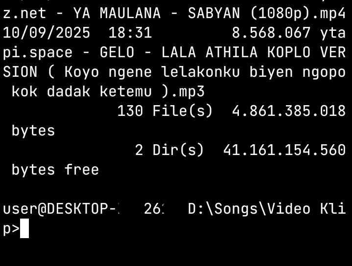
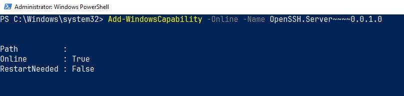

+++
date = '2026-06-22T21:46:07+07:00'
draft = false
title = 'Akses SSH Windows 10'
categories = ["Programming"]
+++



Malam ini pas ngotak-atik komputer PCku tiba-tiba terlintas pikiran *bagaimana cara menjadikan Windows 10 sebagai server SSH dan mengaksesnya dari perankat lain, misal : Termux di hape*. Selama ini aku telah berhasil menjadikan hapeku sebagai server SSH melalui sintaks **sshd** (*tentu dengan instalasi rumit sebelumnya..*).

Sebelumnya aku sempat pesimistis karena PC ini menggunakan OS Windows 10 yang tentunya cukup uzur untuk sebuah PC di tahun 2026, namun setelah browsing beberapa saat, ketemulah caranya :

1. Buka aplikasi **Windows PowerShell** *as Administrator* dan jalankan sintaks ini ```Add-WindowsCapability -Online -Name OpenSSH.Server~~~~0.0.1.0```. 
2. Tunggu proses hingga muncul tampilan berikut :

3. Selanjutnya ketikkan sintaks ```Start-Service sshd```
4. Kemudian ketik sintaks ```Set-Service -Name sshd -StartupType 'Automatic'```
5. Ketik sintaks tambahan ```New-NetFirewallRule -Name sshd -DisplayName 'OpenSSH Server (sshd)' -Enabled True -Direction Inbound -Protocol TCP -Action Allow -LocalPort 22```
6. Kursor pada layar Windows PowerShell akan berkedip-kedip
7. Untuk mengakses ssh dari Termux, silakan ketikkan sintaks ```ssh [username pc/laptop]@ip_pc```. Jika misal diketahui username Windows adalah **budi** dan ip PC adalah **12.345.678.99** (gunakan sintaks ```ipconfig``` pada PowerShell atau Command Prompt untuk mencari ip), maka untuk mengaksess ssh server di PC Windows 10 tadi adalah dengan mengetikkan kode berikut pada Termux :

```ssh budi@12.345.678.99```

8. Akan ada pertanyaan konfirmasi, pilih/ketik **yes**
9. Kemudian kita diminta mengisikan password yaitu password dari login Windows kita
10. Jika berhasil maka pada tampilan Termux kita akan muncul mirip sekali dengan tampilan Command Prompt berserta struktur direktori dan berkas-berkasnya

*Catatan :*
- *Pastikan user login yang digunakan mempunyai password, karena jika tidak, kode di atas tidak akan berjalan.*
- *Untuk saling terhubung antara Termux hape dan PC server ssh, perlu dipastikan keduanya berada pada jaringan yang sama. Misal : keduanya menggunakan wifi sama atau berada pada jaringan LAN yang sama.*

Demikian