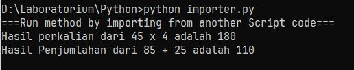
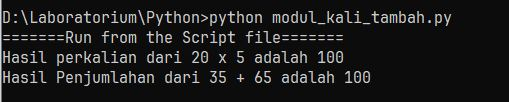

+++
date = '2026-07-15T19:52:52+07:00'
draft = false
title = 'Arti if _name_ == "__main__" pada Script Python'
categories = ["Programming"]
+++

Sebenarnya sudah cukup sering aku menemui sintaks ```if __name__ == '__main__' :``` di banyak script Python. Biasanya berada di bagian paling bawah sebelum kode berakhir. Namun baru akhir-akhir ini aku memahami arti dan cara penggunaannya. Secara singkat menurutku fungsi sintaks itu adalah sebagai batas antara :
- script yang akan dijalankan dari file lain dengan cara di-import; dengan 
- script yang akan dijalankan langsung dari filenya. 
Atau ringkasnya : script di bawah sintaks ini tidak akan dijalankan saat di-import oleh file lain. 
Agak susah dipahami ya?, aku contohin pakai script langsung saja ya.

Misalnya pada file *modul_kali_tambah.py* berisi seperti ini ;
```
def kalikan(a: int, b: int)->int :
	return a * b

def tambahkan(a: int, b: int)->int :
	return a + b

if __name__=="__main__":
	print("=======Run from the Script file=======")
	print(f"Hasil perkalian dari 20 x 5 adalah {kalikan(20, 5)}")
	print(f"Hasil Penjumlahan dari 35 + 65 adalah {tambahkan(35, 65)}")
```

Selanjutnya ada file *importer.py* yang berisi :
```
from modul_kali_tambah import kalikan, tambahkan

print("===Run method by importing from another Script code===")
print(f"Hasil perkalian dari 45 x 4 adalah {kalikan(45, 4)}")
print(f"Hasil Penjumlahan dari 85 + 25 adalah {tambahkan(85, 25)}")
```
Dari script *importer.py* kita tahu bahwa file ini meng-impor method kalikan dan method tambahkan dari file *modul_kali_tambah.py*. Saat file *importer.py* dijalankan akan menghasilkan :


artinya script pada file modul_kali_tambah.py yang berada di bawah ```if __name__=="__main__":``` yaitu :
```
print("=======Run from the Script file=======")
print(f"Hasil perkalian dari 20 x 5 adalah {kalikan(20, 5)}")
print(f"Hasil Penjumlahan dari 35 + 65 adalah {tambahkan(35, 65)}")
```
**tidak dijalankan**.

Perhatikan jika file *modul_kali_tambah.py* kita jalankan langsung hasilnya adalah :


Ini, bagiku, sangat berguna di saat kita ingin method yang ada di suatu file dapat di-impor oleh file lain sehingga kita tidak perlu menuliskan script method yang sama berulang pada file yang memerlukannya.
