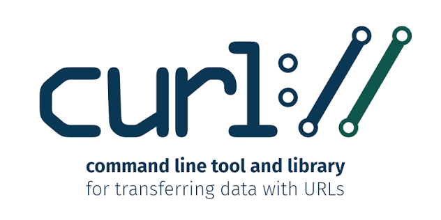

+++
date = '2026-08-24T08:47:33+07:00'
draft = false
title = 'Curl di Windows Command Prompt'
categories = ["Programming"]
+++

Secara umum, request POST dapat dilakukan format :
```
curl -X POST https://example.com \
     -H "Content-Type: application/json" \
     -d '{"name": "John Doe", "email": "john@example.com"}'
```

namun perlu diperhatikan bahwa sintaks di atas tidak berlaku pada Windows command-prompt. Sebagai gantinya gunakan format seperti ini :
```
curl -X -H "Content-Type: application/json" ^
     -d "{\"name\": \"John Doe\", \"email\": \"john@example.com\"}" ^
	 POST https://example.com
```
gunakan tanda *caret (caping)* untuk sintaks multi-line pada akhir baris *kecuali baris terakhir* dan gunakan *escape character backslash ("\")* untuk kutip ganda format JSON yang dikirim.

Untuk POST dengan **Bearer Token** :
```
curl -X -H "Content-Type: application/json" ^
	-H "Authorization: Bearer [tokennya]" ^
    -d "{\"name\": \"John Doe\", \"email\": \"john@example.com\"}" ^
	 POST https://example.com
```

Demikianlah
