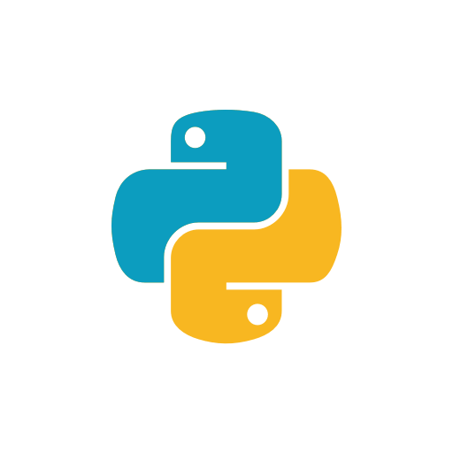

+++
date = '2026-08-31T18:27:15+07:00'
draft = false
title = 'File .env pada Python'
categories = ["Programming"]
+++

Terkadang kita memerlukan pengaturan tertentu pada aplikasi disesuaikan dengan di sistem atau komputer apa aplikasi ini berada. Pada Python pengaturan ini dapat disimpan pada sebuah file **.env**. Berikut langkah-langkahnya :

1. Instal _python-dotenv_ dengan sintaks 
   ```pip install python-dotenv```

2. Buat sebuah file .env dan isi, misal :
   ```
   ASAL=solo
   TUJUAN=jogja
   ```

3. Cara mengambil nilai yang berada di file .env ;
   ```
   from dotenv import load_dotenv

   the_source = os.getenv("ASAL")

   print(the_source) # solo
   ```

Untuk keamanan, pastikan file .env dikecualikan dari _git commit_ dengan menambahkan teks ```.env``` pada baris baru di file _.gitignore_

Contoh untuk Flask :
```
DEBUG = os.getenv("DEBUG") == "True"
```

_sumber : https://medium.com/@rohitkuyadav2003/how-to-use-env-files-in-python-the-right-way-beginner-to-production-2e15228a0a6e_
