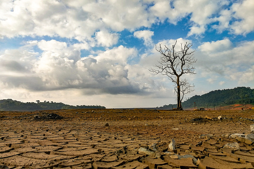

+++
date = '2026-09-30T12:24:05+07:00'
draft = false
title = 'Kemarau Tahun Ini'
categories = ["Daily Notes"]
+++

Musim kemarau tahun ini sangat terasa berbeda dengan tahun lalu. Cuaca terasa lebih panas dibanding kemarau ditahun 2025. Kondisi kontrakanku pun tak jauh beda. Tanpa adanya AC dan hanya mengandalkan kipas angin tua, adalah lebih nyaman saat berada di kamar mandi daripada rebahan di dalam kamar. Jujur selama tinggal di Gresik selama kurang lebih tiga tahun, dua bulan ini adalah salah satu saat yang memerlukan "perjuangan" paling berat.

Aku sudah coba berpindah ke ruang tamu di depan pintu, namun di sana gangguan nyamuk sangatlah masif bahkan dengan dua jenis obat nyamuk, listik dan bakar, gangguan nyamuk tak pernah berkurang. Akhirnya terpaksa aku harus kembali ke ruang tamu dengan konsekuensi udara lebih gerah.

Semoga musim hujan segera datang di awal Oktober ini dan seperti doaku di bulan-bulan yang lalu, semoga segala hal berjalan dengan penuh kedamaian dan ketentraman. Aamiin...
