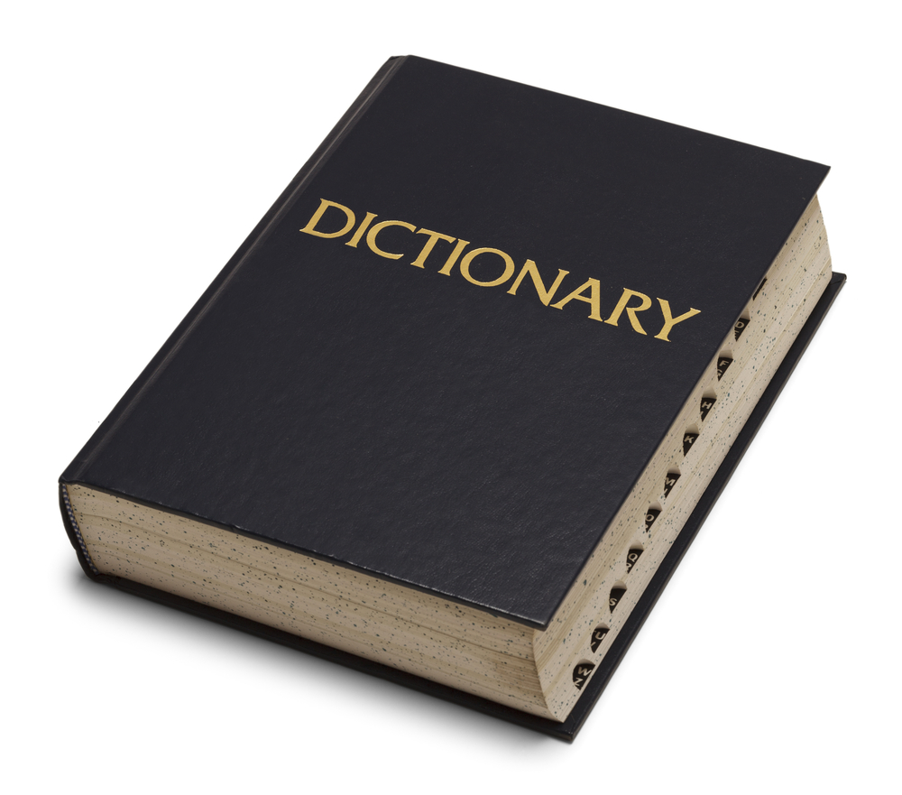

+++
date = '2026-07-09T14:30:46+07:00'
draft = false
title = 'Mari Berkenalan dengan Dict Python'
categories = ["Programming"]
+++


JSON cukup populer di dunia programming tak terkecuali pada bahasa pemrograman Python. Di Python ada tipe yang sangat mirip dengan JSON yaitu **dict**. Dict (singkatan dari Dictionary) terdiri dari pasangan **key** dan **value**. Contohnya seperti ini :
```
myprofil = {
	"id": 1,
	"nama":"Budi",
	"poin": 13998
	}
```
Pada contoh di atas, **id**, **nama**, dan **poin** adalah contoh key, sedangkan **1**, **Budi**, dan **13998** adalah value-nya.

Untuk mengakses value dari suatu key Dict, gunakan ```dict.get([nama_key])```. Untuk variabel *kamus* di atas, jika kita ingin mencari nilai dari *poin*, maka sintaksnya adalah :
```
poinku = myprofil.get("poin") # menghasilkan : 13998
```
Bagaimana jika kita ingin memunculkan seluruh key yang ada pada suatu dict?. Gunakan method ```.keys()```
```
all_keys = myprofil.keys()

print(all_keys) # akan menghasilkan : dict_keys(['id', 'nama', 'poin'])
```
kemudian bisa kita lakukan pengulangan dengan ```for``` :
```
for i in all_keys:
	print(i)
```

Selanjutnya, untuk menampilkan seluruh value, gunakan method ```.values()``` :
```
myvalues = myprofil.values()

print(myvalues) # hasil : dict_values([ 1, 'Budi', 13998]) 
```

Ingin menampilkan seluruh pasangan key dan value, gunakan ```.items()``` :
```
semua = myprofil.items()

print(semua) # hasil : dict_items([('id', 1), ('nama', 'Budi'), ('poin', 13988)])
```

Lanjut ke part 2 ya ...
