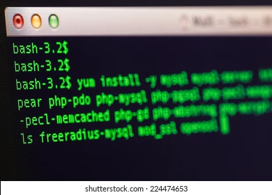

+++
date = '2026-09-21T09:51:53+07:00'
draft = false
title = 'Mengganti Nama File dengan Bash Sederhana'
categories = ["Programming"]
+++


Ada saatnya kita ingin me-rename file dengan langkah sesederhana mungkin. Ini dapat dilakukan dengan _Bash_ pada _Terminal Termux_ di handphone atau _Cygwin_ di Windows.

Misal, seperti pada post posts/mengganti-teks-pada-semua-file-dengan-bash/, kita ingin mengganti nama string _anjrot_ dari nama files semua file .txt menjadi _amsyong_, maka jalakan kode ini :

```for f in *.txt;do mv "$f" "${f/anjrot/amsyong}";done```

maka file _catatan_anjrot.txt_ akan di-rename menjadi _catatan_amsyong.txt_.

Begitulah...