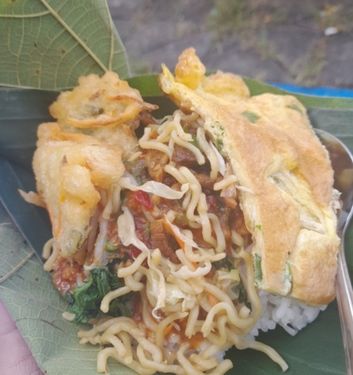

+++
date = '2026-05-28T00:27:55Z'
draft = false
title = 'Nasi Pecel Mbak Yat'
+++

Belasan tahun yang lalu ada tetangga kami yang berjualan nasi pecel yang sangat
enak dan bahkan menjadi langganan keluarga kami. Beliau adalah *mBak Yat*, begitu
kami mengenalnya. Hampir tiap hari, aku
"ditugasi" nenekku untuk membeli nasi pecel disini untuk sarapan seluruh anggota
keluarga kami. Tak kurang dari delapan bungkus nasi pecel, hampir setiap harinya.
Nasi pecel mBak Yat mempunyai cita rasa pedas yang pas dan bagian yang paling kuingat
adalah lauk tempe gorengnya yang memiliki tekstur luar renyah namun lapisan dalamnya lembut seperti tempe mendoan. Bila ingin tambahan lain, pembeli bisa
*request* lauk telur dadar. Namun nasi pecel yang kami pesan selalu nasi pecal
*original* dengan lauk tempe goreng. Dari satu bungkus seharga Rp100 (ya, seratus
rupiah) hingga terakhir aku menjalankan tugas ini nasi pecel mbak Yat seharga
Rp500.
